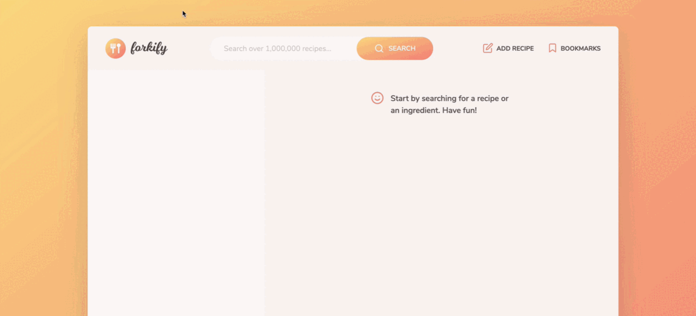

# Forkify

An application developed with HTML, SCSS, CSS, and advance JavaScript concepts. It seamlessly loads APIs to showcase a comprehensive collection of recipes. Users can effortlessly search for their desired recipes, bookmark favorites, and even upload new recipes. It combines a sleek design with powerful functionality, delivering an exceptional user experience.

## Project GIF

<div class="gif-container" style="display: flex; justify-content: center; margin-left: auto; margin-right: auto;">
    
</div>


## 🛠️ Installation Steps

1. Clone the repository

```bash
git clone https://github.com/maham-ishtiaq-2000/Forkify.git
```

2. Change the working directory

```bash
cd Forkify.git
```

3. Install dependencies

```bash
npm install -y
npm install parser
npm install @parcel/transformer-sass
```

4. Run the app

```bash
npx parcel index.html
```

🌟 You are all set!

## 💻 Built with

- [HTML](https://www.gatsbyjs.com/) for structure
- [SCSS](https://tailwindcss.com/) for styling
- [JavaScript](https://greensock.com/gsap/) for adding functionality
